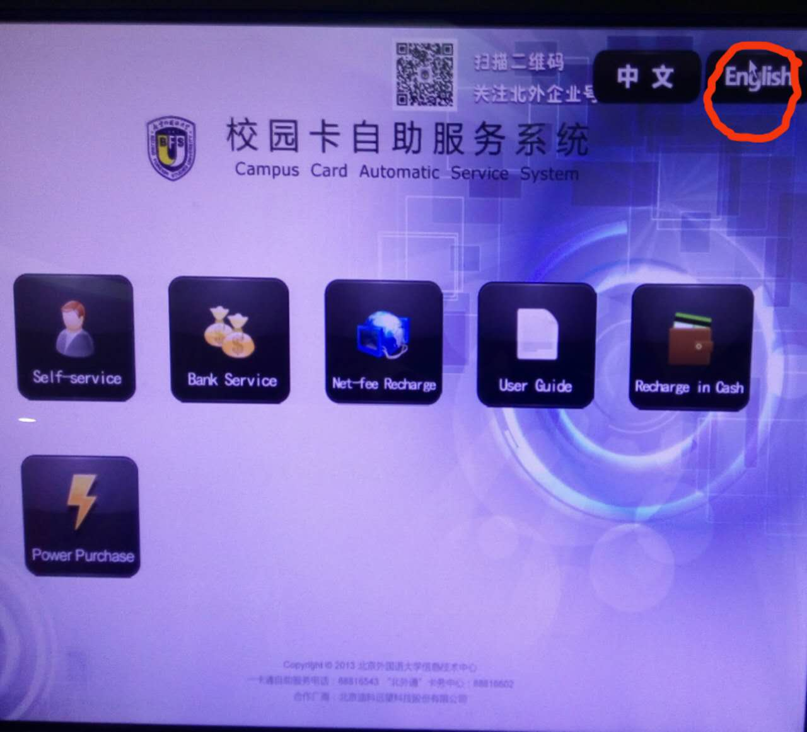
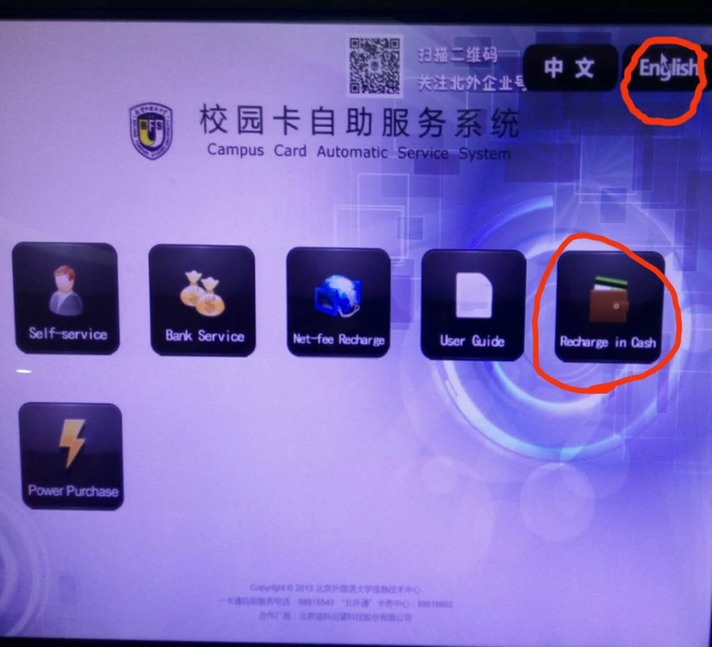
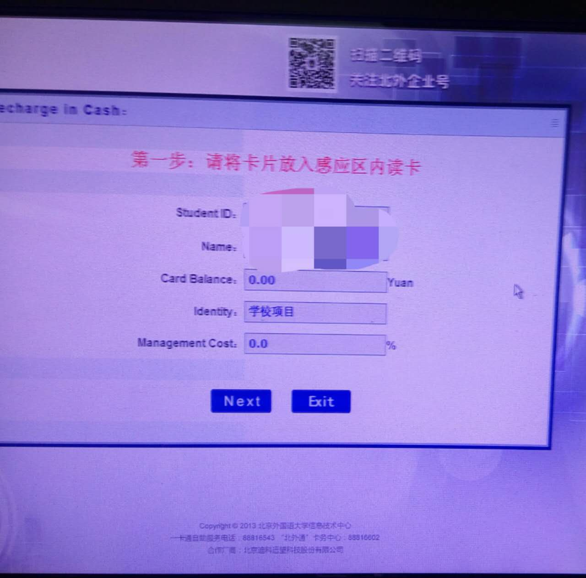
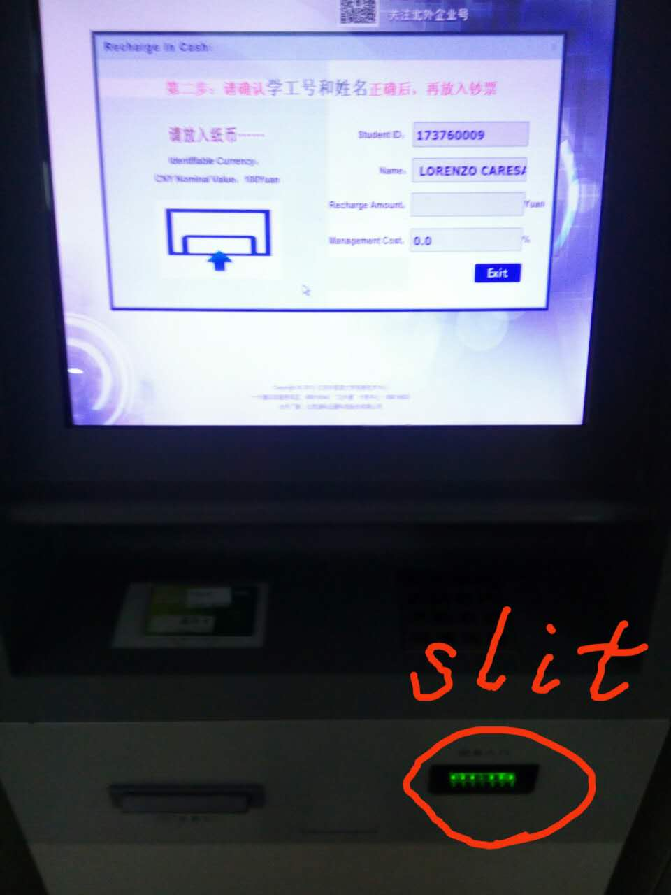
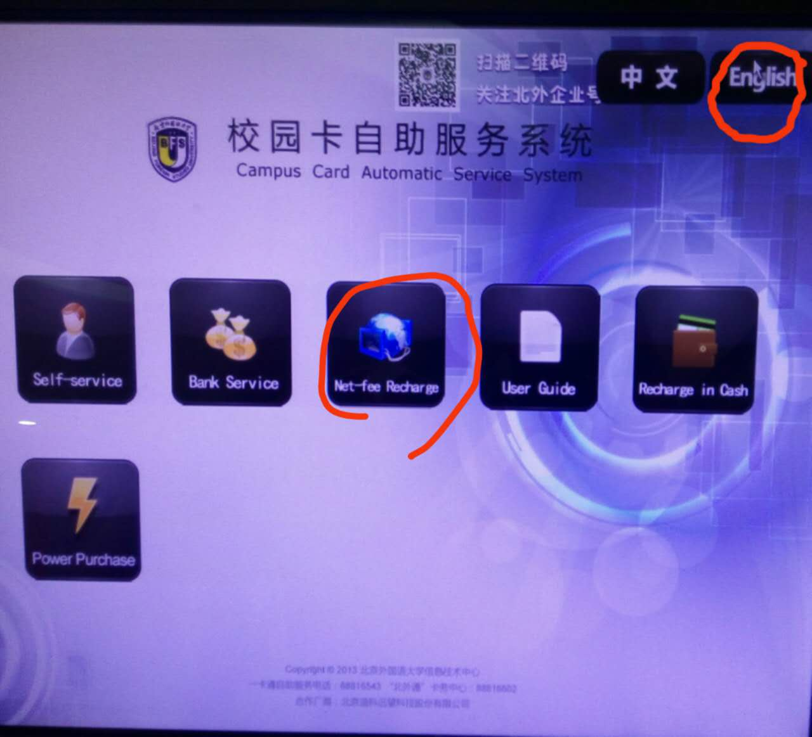
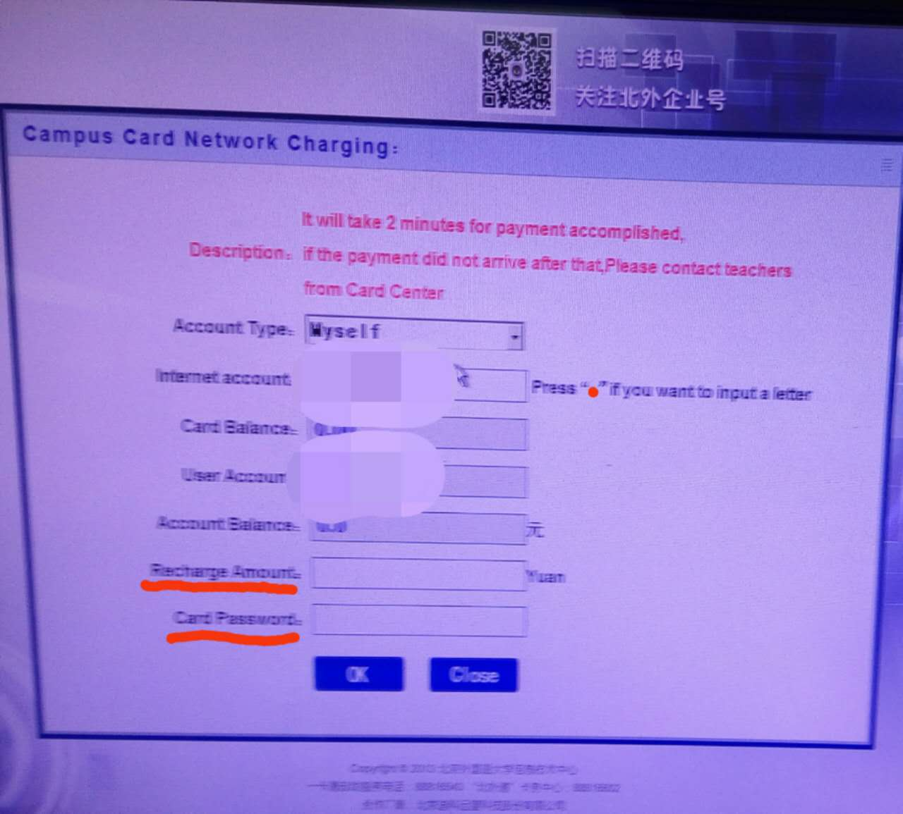
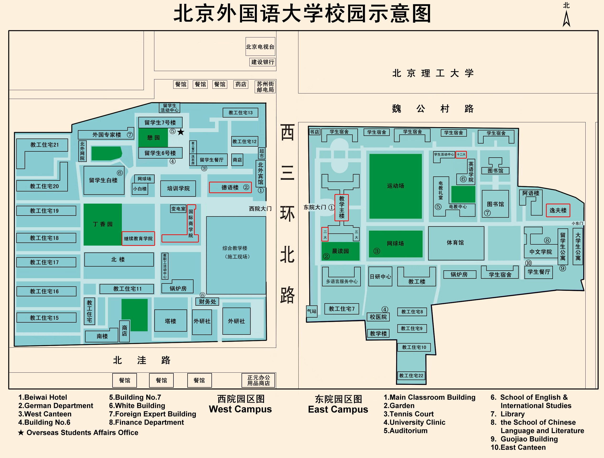

#Survival Guide for International Students - Frequently Asked Questions
#### Last edited by 高垚鑫 at July 3rd 2017, 15:00 Beijing Time.

## What is the BFSU card used for?
### It could be used for canteen, library and gym.

## How can the BFSU card be topped up?
### There are two machines at the card service center. Use 100-RMB-notes for charging. Follow the specific steps below.
1. Put your card on the machine.
2. Change the language into English.

3. Choose "Recharge in Cash".

4. Point "Next".

5. Put 100-RMB-notes one by one into the slit.

6. Remember to take your card back with you.

## How can I get access to campus Wifi(east and west) ?
#### Charge first. Go to the machine at card service center or any other same machines(1F Students' Canteen east campus, 2F Students' Canteen west campus, etc.) to charge (using the balance already inside the BFSU card, no cash needed). The fee is 60 RMB/month. Follow the specific steps below.
1. Put your card on the machine.
2. Change the language into English.
3. Choose "Net-fee Recharge".

4. Input "60" in the inputbox of "Recharge Amount" and your card password (last 6 digits of your passport as default. Change it using the same machine.)

5. Press the "OK" button.
6. Remember to take your card back with you.

#### Login in. For BFSU and BFSU Secure, use your ID number(9-digit number beginning with 1737600) as username and last 6 numbers of your passport ID number as passcode to log in.  
### For BFSU Web, you could connect it directly. A webpage should be opened up automatically in your browser then. Login at this page. If it does not open automatically, input ca.bfsu.edu.cn to open up this login page.

## No campus Wifi could be found inside my dorm. What can I do?
#### There is a guy who could install network for your room. The fee is 80 RMB/month and 100 RMB for deposit. Call him by (86) 134-2631-5186 or directly ask assistants at 1F counter for help.

## Can I use Google?
### If you are connected to BFSU Secure and BFSU, the answer is yes(facebook and youtube is also availabe).

## Is there a digital version of campus map?
#### Yes. Go to http://map.bfsu.edu.cn/ for a 3D version. Or here porvides a 2D one.

